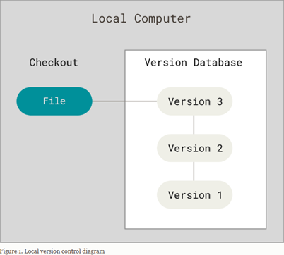
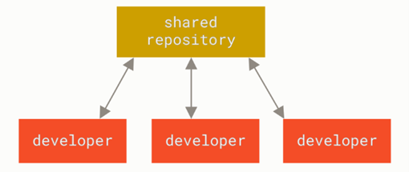
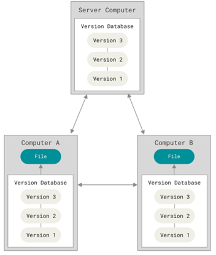

# About Version Control
What is “version control”, and why should you care? Version control is a system that records changes to a file or set of files over time so that you can recall specific versions later.
If you are a graphic or web designer and want to keep every version of an image or layout (which you would most certainly want to), a Version Control System (VCS) is a very wise thing to use. It allows you to revert selected files back to a previous state, revert the entire project back to a previous state, compare changes over time, see who last modified something that might be causing a problem, who introduced an issue and when, and more. Using a VCS also generally means that if you screw things up or lose files, you can easily recover. In addition, you get all this for very little overhead.

## Types of Version Control System
### Local Version Control Systems
Imagine you have a project, and you make different versions of it by copying the entire project into separate folders each time you make changes. For example, you might have folders like "Project_v1," "Project_v2," and so on. Over time, you end up with many folders, each containing a slightly different version of the project.
Now, fast forward to a few months or years later. You need to find a specific version of the project, but you can't remember which folder contains the version you need. You have to open each folder, check the files, and try to figure out which version is which. This is a messy and time-consuming situation, especially since there's no clear record of what changes were made in each version. This is what happens when you rely on a manual, local version control system by copying folders.
This approach is very common because it is so simple, but it is also incredibly error prone. It is easy to forget which directory you’re in and accidentally write to the wrong file or copy over files you don’t mean to.
To deal with this issue, programmers long ago developed local VCSs that had a simple database that kept all the changes to files under revision control.

  

One of the most popular VCS tools was a system called RCS, which is still distributed with many computers today. RCS works by keeping patch sets (that is, the differences between files) in a special format on disk; it can then re-create what any file looked like at any point in time by adding up all the patches.

### Centralized Version Control Systems
The next major issue that people encounter is that they need to collaborate with developers on other systems. To deal with this problem, Centralized Version Control Systems (CVCSs) were developed. These systems (such as CVS, Subversion, and Perforce) have a single server that contains all the versioned files, and a number of clients that check out files from that central place. For many years, this has been the standard for version control.

  

### Distributed Version Control Systems
This is where Distributed Version Control Systems (DVCSs) step in. In a DVCS (such as Git, Mercurial
or Darcs), clients don’t just check out the latest snapshot of the files; rather, they fully mirror the
repository, including its full history. Thus, if any server dies, and these systems were collaborating
via that server, any of the client repositories can be copied back up to the server to restore it. Every
clone is really a full backup of all the data.

  

Furthermore, many of these systems deal pretty well with having several remote repositories they
can work with, so you can collaborate with different groups of people in different ways
simultaneously within the same project. This allows you to set up several types of workflows that
aren’t possible in centralized systems, such as hierarchical models.
